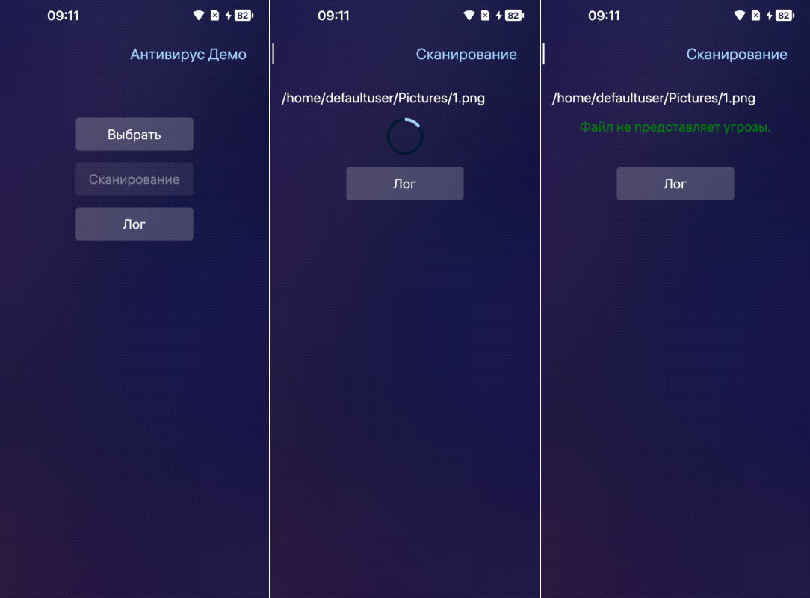

# Антивирус Демо

Приложение демонстрирует работу API с которым может взаимодействовать антивирус приложение. В ОС Аврора есть сервис av-launcher, который
запускается после загрузки системы от имени текущего пользователя с минимальным необходимым набором прав, имеет доступ к файлам текущего
пользователя на чтение и запись, а также доступ к некоторым системным файлам.  
Для его работы нужно в секцию install в .spec файле дописать следующее:  
```
mkdir -p %{buildroot}%{_sysconfdir}/av-launcher
ln -s %{_datadir}/applications/%{name}.desktop \
    %{buildroot}%{_sysconfdir}/av-launcher/antivirus.desktop
%files
%{_sysconfdir}/av-launcher/antivirus.desktop
```  
Сервис обладает такими возможностями: Доступ к стандартным директориям пользователя, дополнительные события аудита с помощью libomplog(AV_SERVICE_STARTED,
AV_SCAN_STARTED, ...). Для записи данных о событиях в десктоп файле указывается разрешение LogSecurityEvents. Также предоставляется доступ к модулю 
безопасности die-hard.  
В отдельный файл записывается лог приложения. На эмуляторе лог создаваться не будет.

## Важно

Для установки приложения его RPM-пакет должен быть подписан ключом с профилем **antivirus**.

## Использование

После запуска приложения, нужно будет запустить сервис. Для этого нужно подключиться на устройство или эмулятор и запустить сервис:
```
$ /usr/bin/ru.auroraos.AntivirusDemo --service
```
Лог событий будет писать через сервис приложение. Файлы с расширением rpm будут считаться, как файлы представляющие угрозу.  

## Условия использования и участия

Исходный код проекта предоставляется по [лицензии](LICENSE.BSD-3-Clause.md),
которая позволяет использовать его в сторонних приложениях.

[Соглашение участника](CONTRIBUTING.md) регламентирует права,
предоставляемые участниками компании «Открытая Мобильная Платформа».

Информация об участниках указана в файле [AUTHORS](AUTHORS.md).

[Кодекс поведения](CODE_OF_CONDUCT.md) — это действующий набор правил
компании «Открытая Мобильная Платформа»,
который информирует об ожиданиях по взаимодействию между членами сообщества при общении и работе над проектами.

## Структура проекта

Проект имеет стандартную структуру приложения на базе C++ и QML для ОС Аврора.

* Файл **[CMakeLists.txt](CMakeLists.txt)** описывает структуру проекта для системы сборки CMake.
* Каталог **[icons](icons)** содержит иконки приложения для поддерживаемых разрешений экрана.
* Каталог **[qml](qml)** содержит исходный код на QML и ресурсы интерфейса пользователя.
  * Каталог **[assets](qml/assets)** содержит дополнительные иконки интерфейса пользователя.
  * Каталог **[cover](qml/cover)** содержит реализации обложек приложения.
  * Каталог **[pages](qml/pages)** содержит страницы приложения.
  * Каталог **[utils](qml/utils/)** содержит вспомогательные функции.
  * Файл **[AntivirusDemo.qml](qml/AntivirusDemo.qml)** предоставляет реализацию окна приложения.
* Каталог **[rpm](rpm)** содержит настройки сборки rpm-пакета.
  * Файл **[ru.auroraos.AntivirusDemo.spec](rpm/ru.auroraos.AntivirusDemo.spec)** используется инструментом rpmbuild.
* Каталог **[src](src)** содержит исходный код C++.
  * Каталог **[av](src/av)** содержит интерфейс работы с API антивируса.
  * Каталог **[logger](src/logger)** содержит логгер событий приложения.
  * Файл **[main.cpp](src/main.cpp)** является точкой входа приложения.
* Каталог **[translations](translations)** содержит файлы перевода пользовательского интерфейса.
* Файл **[ru.auroraos.AntivirusDemo.desktop](ru.auroraos.AntivirusDemo.desktop)** определяет отображение и параметры для запуска приложения.

## Снимки экранов



## This document in English

- [README.md](README.md)
